# 🌐 JobPortal

**JobPortal** est une application MERN qui connecte **entreprises** et **candidats** pour faciliter le processus de recrutement en ligne. Les entreprises peuvent publier des offres d'emploi et gérer les candidatures reçues, tandis que les candidats peuvent explorer les offres, postuler et suivre le statut de leurs candidatures.

Cette plateforme simplifie le recrutement grâce à une interface intuitive et des fonctionnalités adaptées aux besoins des deux types d'utilisateurs.

---

## 📋 Fonctionnalités Principales

- **⭐ Une entreprise 🏬 peut :**
    - S'authentifier 🔒
    - Modifier son profil 🛠️
    - Publier des offres d'emploi 📄
    - Voir et gérer les candidatures reçues 📨
    - Accéder aux profils des candidats ayant postulé 👤
    - Gérer les candidatures (CRUD)
    - Planifier des interviews avec les candidats 📅

- **⭐ Un candidat 👨‍💼 peut :**
    - Créer et gérer son profil 📝
    - Postuler aux offres d'emploi ✅
    - Suivre le statut de sa candidature :
        - Refusée ❌
        - Acceptée ✅
        - En attente 🕒
    - Consulter les profils des entreprises 👁️
    - Ajouter et gérer son CV 📄
    - Suivre des statistiques sur ses candidatures 📊

- **⭐ Spécialités de notre plateforme**
    - Filtres avancés pour faciliter la recherche et la navigation 🎯
    - Interface moderne pour une expérience utilisateur agréable et fluide 🎨


## 🚀 Comment tester l'application ?
- **🔧 Pré-requis** :
    - Docker Desktop 🐳
    - Docker-Compose doit être installé sur votre machine

- **⚙️ Lancer l'application :**
    1. Cloner le dépôt 📥
    ```bash
    git clone https://github.com/Ayuubakb/JobPortail-MERN.git
    ```
    
    2. Se positionner dans le dossier du projet 📂
    ```bash
    cd JobPortal
    ```

    3. Construire les conteneurs Docker 🏗️
    ```bash
    docker-compose build
    ```

    4. Démarrer les services en arrière-plan 🚀
    ```bash
    docker-compose up -d
    ```

Après ces étapes, l'application sera prête à être testée sur votre machine via Docker. 

---


## Conception 📊
- **MCD :**
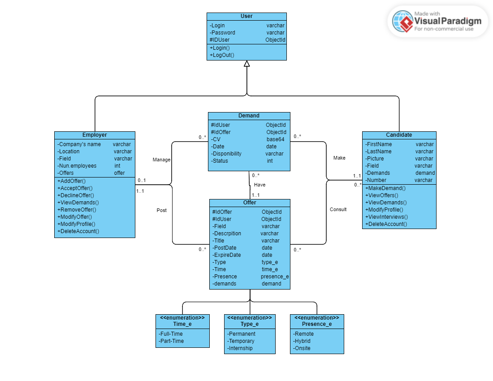
********
- **Outile :**
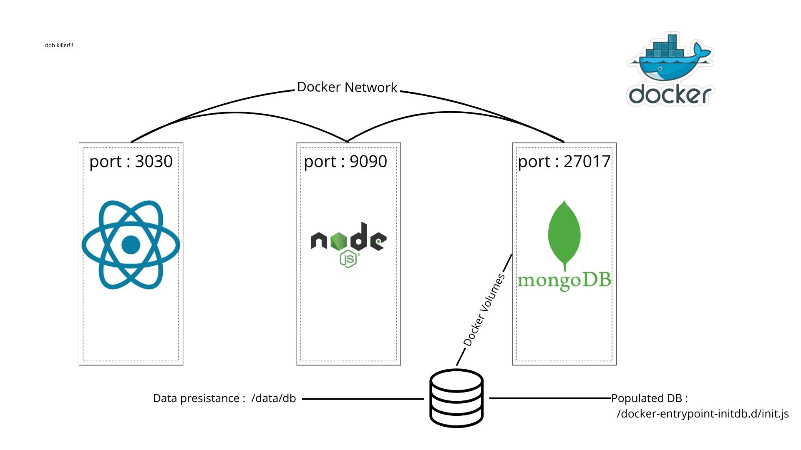

## Demo

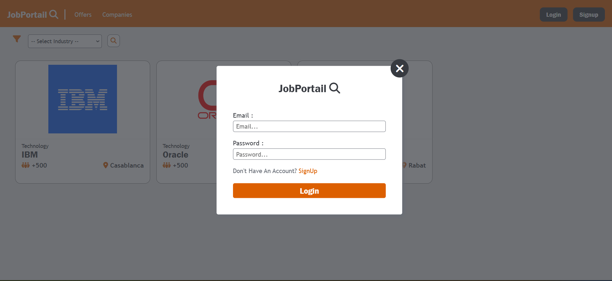
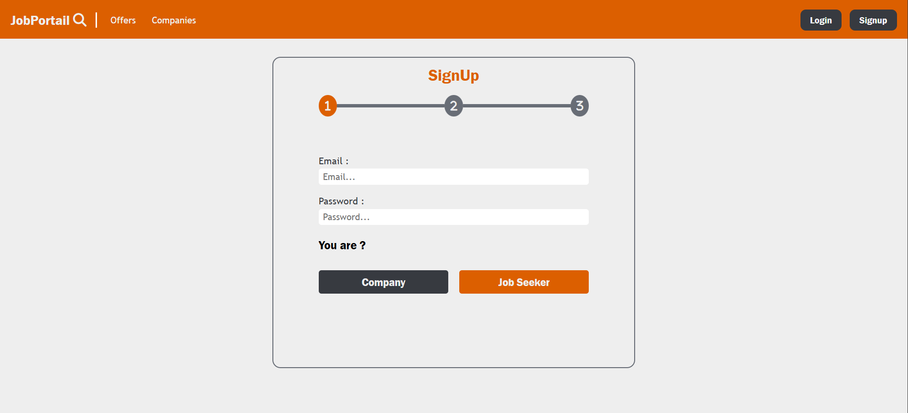
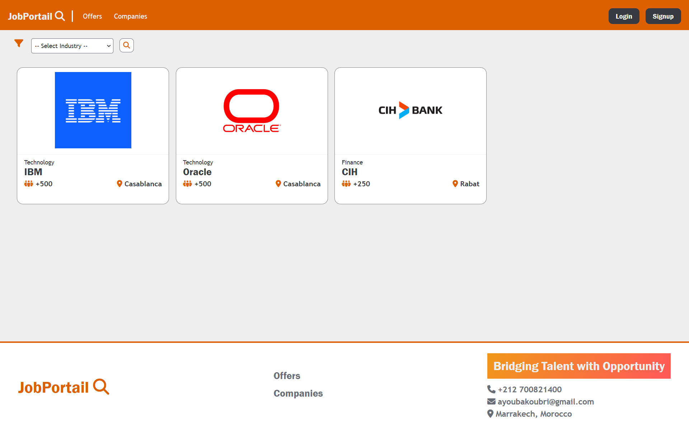
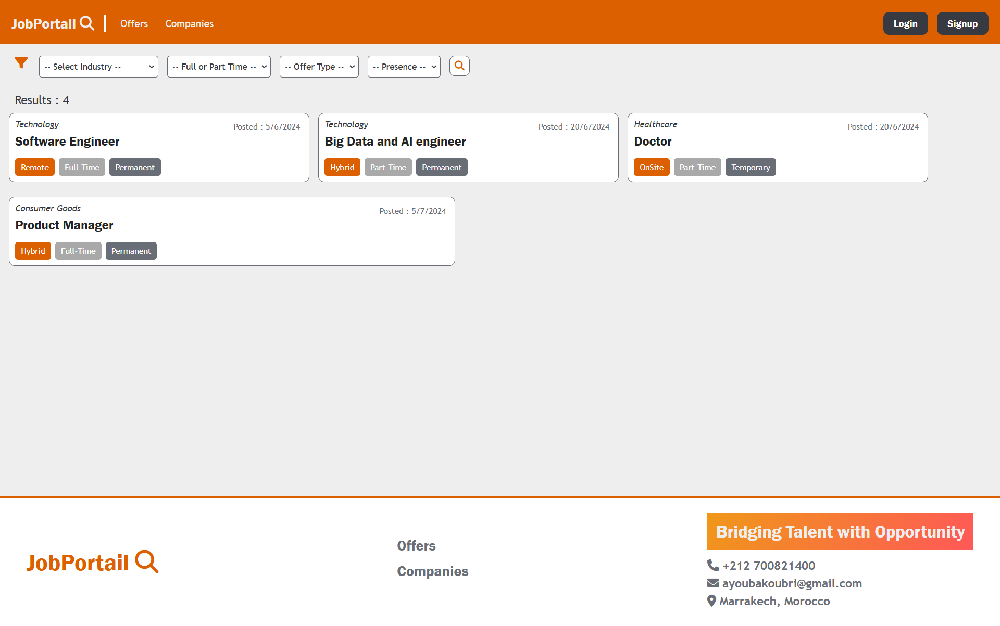
****
- **Entreprise 🏬 :** 
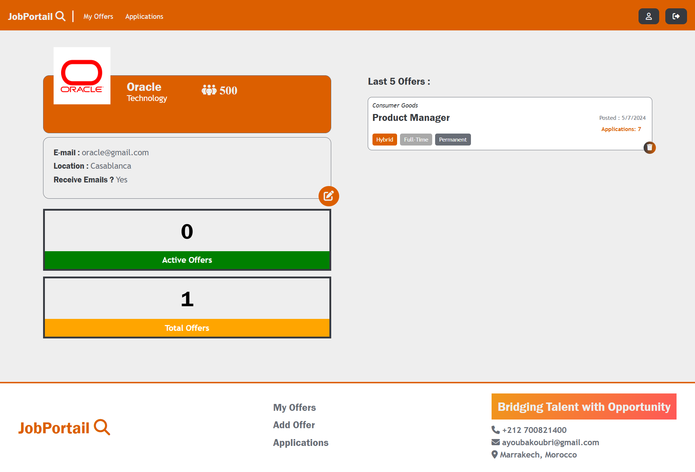

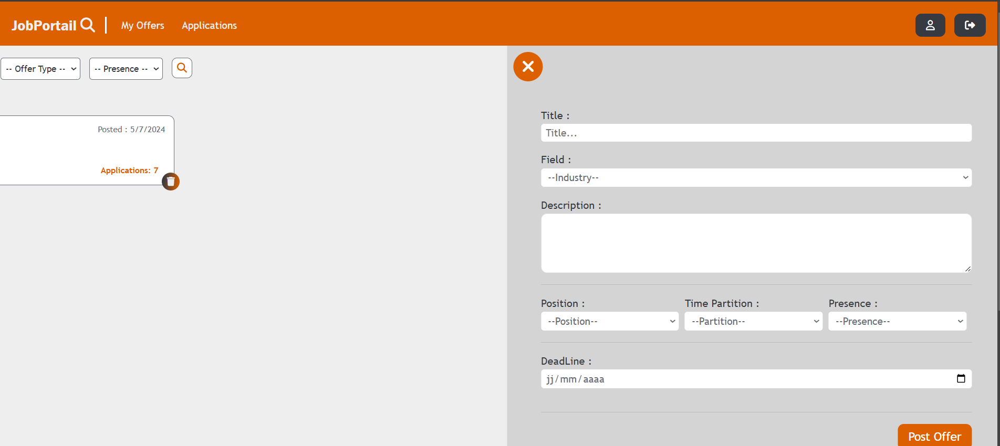
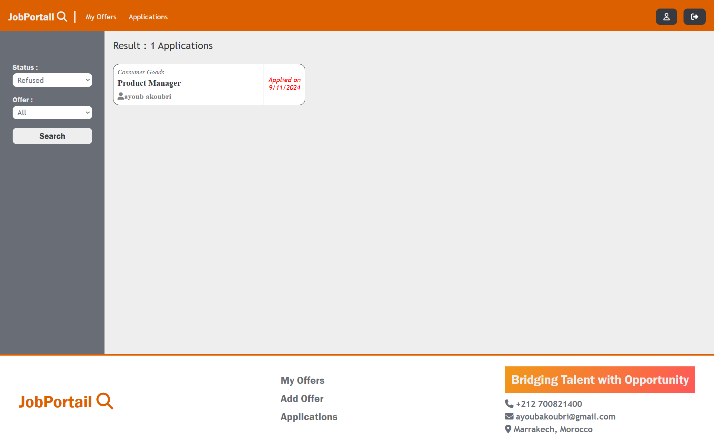
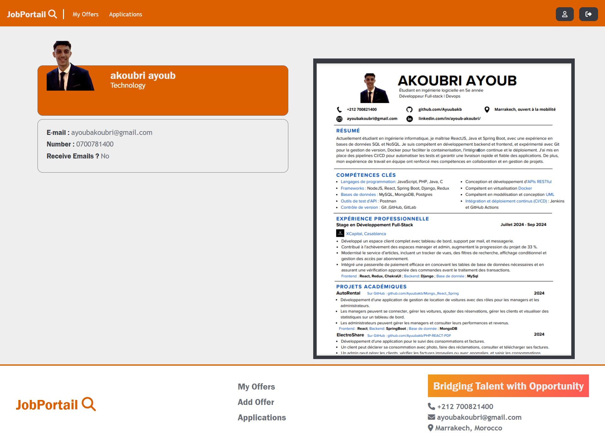
*****************
- **Candidat 👨‍💼 :**

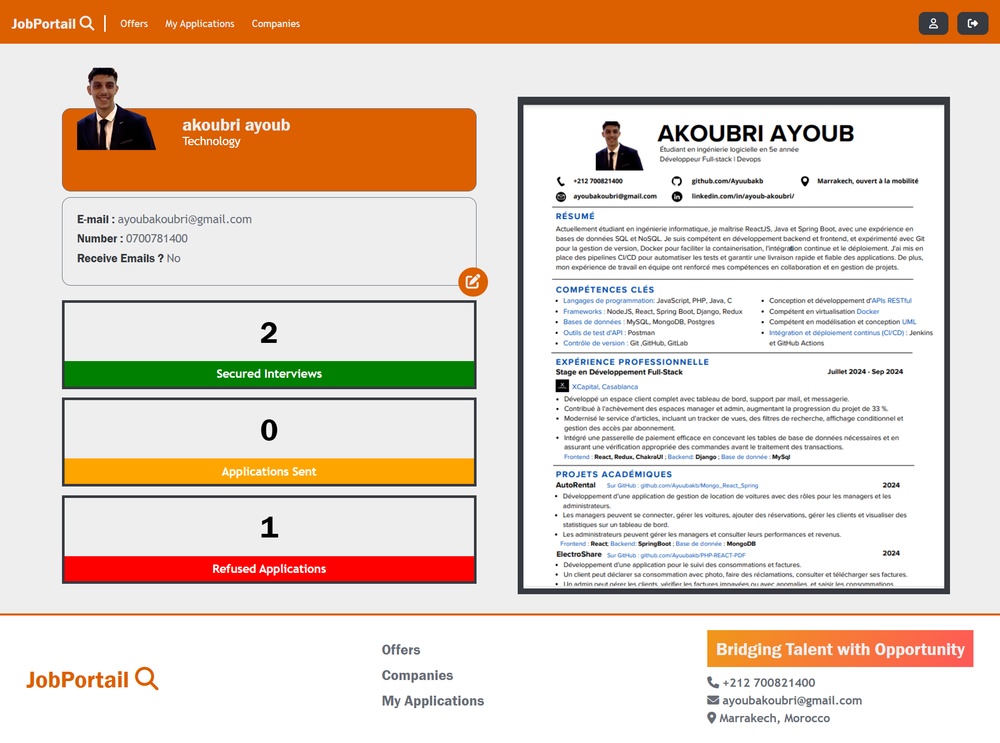
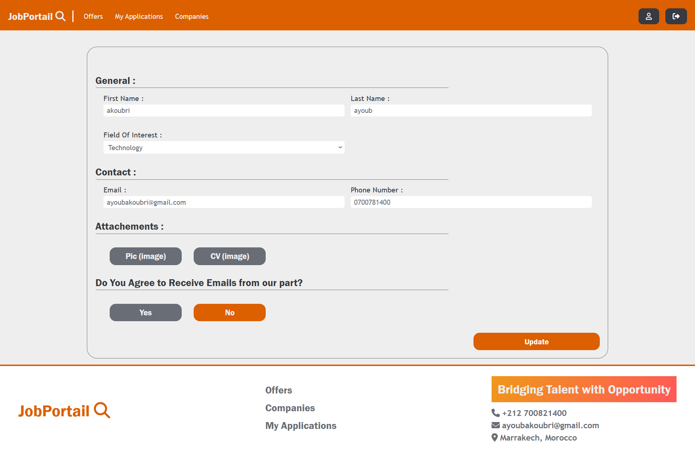

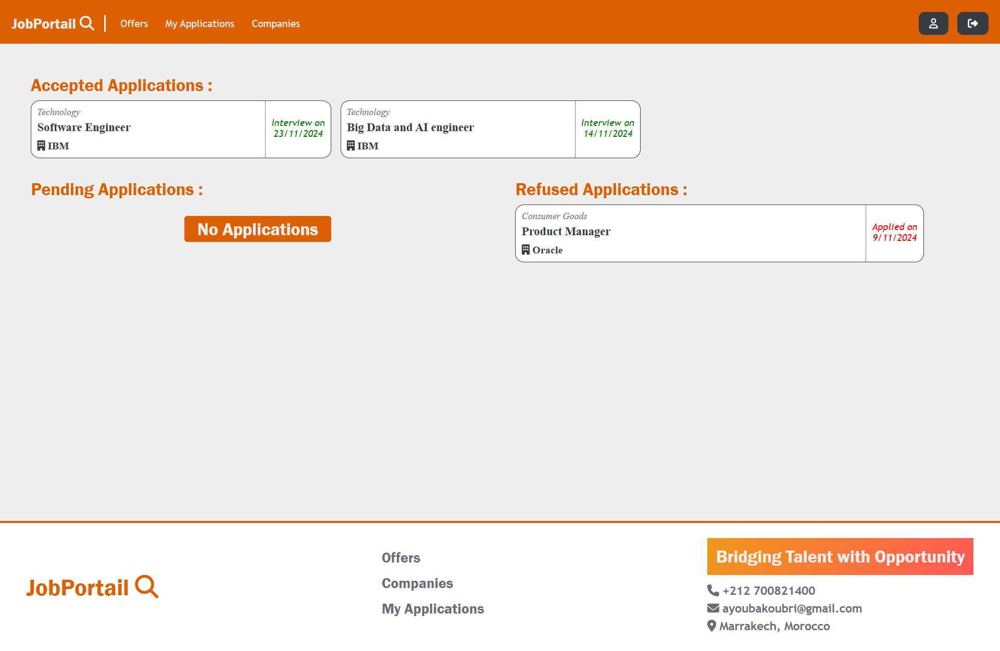


## Acknowledgements

 - [Awesome Readme Templates](https://awesomeopensource.com/project/elangosundar/awesome-README-templates)
 - [Awesome README](https://github.com/matiassingers/awesome-readme)
 - [How to write a Good readme](https://bulldogjob.com/news/449-how-to-write-a-good-readme-for-your-github-project)
 - [Docker Docs](https://docs.docker.com/)
 - [Mongo Docs](https://www.mongodb.com/docs)
 - [React Docs](https://react.dev/)
